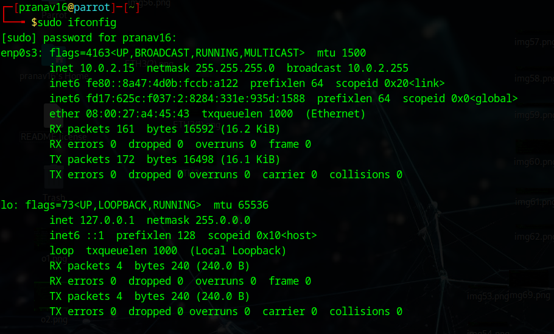

# Metasploit-for-reconnaissance
# Metasploit
Metasploit for reconnaissance in pentesting

# AIM:

To get introduced to Metasploit Framework and to  perform reconnaissance  in pentesting .

## DESIGN STEPS:

### Step 1:

Install kali linux either in partition or virtual box or in live mode

### Step 2:

Investigate on the various categories of tools as follows:

### Step 3:

Open terminal and try execute some kali linux commands

## EXECUTION STEPS AND ITS OUTPUT:

Find out the ip address of the attackers system
## OUTPUT:

Invoke msfconsole

## OUTPUT:

.png)

Type help or a question mark "?" to see the list of all available commands you can use inside msfconsole

## OUTPUT:

.png)

Port Scanning:

msf >  nmap -sT 192.168.1810/24 -p1-1000

## OUTPUT:

.png)

scan the targets with the command db_nmap as follows.
msf > db_nmap 192.168.181.0/24

# OUTPUT:

.png)

cd /usr/share /metasploit-framework/modules/auxiliary
kali > ls -l

## OUTPUT:

.png)

msf >search name:Microsoft type:exploit

## OUTPUT:

.png)

The info command provides information regarding a module or platform,

## OUTPUT:

-1.png)

Before beginning, set up the Metasploit database by starting the PostgreSQL server and initialize msfconsole database as follows:
systemctl start postgresql
msfdb init

## MYSQL ENUMERATION
Find the IP address of the Metasploitable machine first. Then, use the db_nmap command in msfconsole with Nmap flags to scan the MySQL database at 3306 port.

db_nmap -sV -sC -p 3306<metasploitable_ip_address>

## OUTPUT:

-1.png)

Use the search option to look for an auxiliary module to scan and enumerate the MySQL database.

search type:auxiliary mysql

## OUTPUT:
-1.png)

use the auxiliary/scanner/mysql/mysql_version module by typing the module name or associated number to scan MySQL version details.

use 11

## OUTPUT:

-1.png)

Use the set rhosts command to set the parameter and run the module, as follows:

## OUTPUT:

-1.png)

After scanning, you can also brute force MySQL root account via Metasploit's auxiliary(scanner/mysql/mysql_login) module.

## OUTPUT:
-1.png)

set the PASS_FILE parameter to the wordlist path available inside /usr/share/wordlists:
set PASS_FILE /usr/share/wordlistss/rockyou.txt
Then, specify the IP address of the target machine with the RHOSTS command.
set RHOSTS <metasploitable-ip-address>
Set BLANK_PASSWORDS to true in case there is no password set for the root account.
set BLANK_PASSWORDS true

## OUTPUT:

-1.png)

## RESULT:
The Metasploit framework for reconnaissance is  examined successfully
